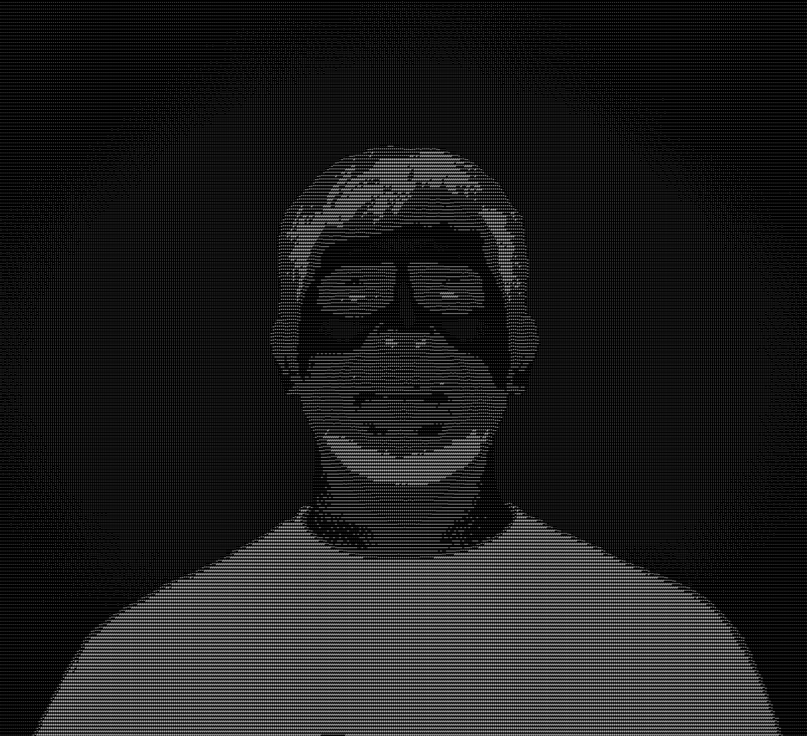

<picture>
  <source media="(prefers-color-scheme: light)" srcset="assets/juanfetch-light.svg">
  
</picture>

 

**Software Engineer · trained in Astronomy & Physics Education**

Most of my repos are private — the portfolio has the extended intro, and Calendly gets you a live walkthrough.

---

### 🛰️ What I'm building

| Project | What it is | Status |
|---|---|---|
| **pin** | Document intelligence for legal case files — interrogate thousands of scanned pages, every answer cited to the exact page (local-first OCR + RAG). | 🟢 in production — private demo |
| **talia** | Early chainsaw alerts against illegal logging — solar IoT ears in the forest, ML classification, evidence-backed dispatch within minutes | 🔧 hardware in dev · fundraising |
| **vi2bo** | Video → typeset PDF: lectures and recipes transcribed to structured Markdown, then LaTeX-compiled into print-quality documents | 🟢 in production |
| **palomita** | Weekly memory for my repos — auto changelogs, README-drift PRs, and a cross-repo newsletter, run entirely on GitHub Actions | 🔒 private — ask me |
| **queltehue** | A sentinel for autonomous coding agents — risky forks escalate to Telegram buttons or a hands-free phone call | 🔒 private — ask me |
| **juanOS** | An operating system for a human life — surfaces the ≤3 things that matter today; health before output, never streaks or shame | 🔒 private — ask me |

…plus a toolbox of private experiments: <b>QR-recover</b> (Reed-Solomon repair of a damaged ID-card QR), <b>concon</b>, <b>onthemerge</b>, <b>bootflower</b>, and <b>67</b> 🎲

### 🔭 Science & ML

- **Gravitational dynamics** — thesis on the dynamics of an exoplanetary system (planet formation via orbital-parameter analysis); now building **pleamar**: gravitational dynamics, formation and flow simulation
- **Bioinformatics** — collaboration on bioinformatics for microbiology with the Microbiology Lab at Universidad de Chile (publication incoming 2026, Patricia Palma et al.)
- **Computer vision** — vehicle speed tracking on roadways (YOLO, Detectron) and road-damage detection with Mapillary imagery + fine-tuning
- **Radioastronomy** — calibration and HI 21cm observation work at Centro Astro-Ingeniería UC

### 🏗️ Track record

- **[pin](https://jjsutil.github.io/pin-landing/)** — founding software engineer (2026 — now); legaltech in production, private demo with real users — verifiable-citation document intelligence
- **[HealthAtom](https://healthatom.com)** — Full-stack Development Software Engineer on core healthtech products (Dentalink, Medilink, Gerty) used by clinics across LATAM (2025 – 2026)
- **[Reimpact](https://reimpact.cl)** — engineer #2; helped scale a B2B SaaS from 4 to 20+ enterprise clients, +60% efficiency in core workflows, test coverage 0% → 67%
- **[CNTV](https://cntvinfantil.cl/series/manos-al-experimento/)** — sole scientific advisor for a children's science TV series (13 episodes, one intense week of filming 🎬)

---

<picture>
  <source media="(prefers-color-scheme: light)" srcset="https://github-readme-stats.vercel.app/api?username=jjsutil&show_icons=true&count_private=true&theme=default&hide_border=true">
  
</picture>
<picture>
  <source media="(prefers-color-scheme: light)" srcset="https://github-readme-stats.vercel.app/api/top-langs/?username=jjsutil&layout=compact&theme=default&hide_border=true">
  
</picture>

<code>uptime</code> counted since 1997-06-23 · stats include private contributions · the fetch panel is an SVG, view it raw if you dare

