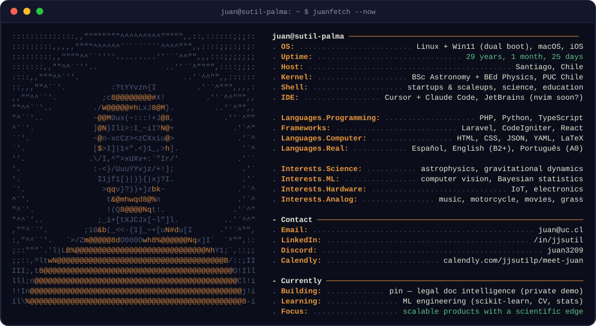

<picture>
  <source media="(prefers-color-scheme: light)" srcset="assets/juanfetch-light.svg">
  
</picture>

 

**Software Engineer · trained in Astronomy & Physics Education**

Most of my repos are private — the portfolio has the extended intro, and Calendly gets you a live walkthrough.

---

| | | |
|---|---|---|
| **big projects** | | |
| pin | legal-doc intelligence — thousands of scanned pages, every answer cited to its page | in production |
| talia | chainsaw alerts against illegal logging — solar IoT + ML classification | hardware in dev |
| vi2bo | video → typeset PDF — lectures transcribed, LaTeX-compiled | in production |
| **side** | | |
| palomita | weekly memory for my repos — auto changelogs + README-drift PRs | private |
| queltehue | sentinel for autonomous coding agents — risky forks escalate to a phone call | private |
| juanOS | an operating system for a human life — the ≤3 things that matter today | private |
| **devops / powertools** | | |
| concon | repository measurement observatory | private |
| QR-recover | Reed-Solomon repair of a damaged ID-card QR | private |
| onthemerge | terminal daemon that makes your GitHub fleet audible | private |
| bootflower | workflow bootstrapper that blooms in every repo | private |
| **ML** | | |
| pleamar | gravitational dynamics — formation & flow simulation | starting |
| bioinformatics | microbiology collab with Universidad de Chile | publication 2026 |
| speed tracking | vehicle speed on roadways — YOLO, Detectron | done |
| road damage | detection with Mapillary imagery + fine-tuning | done |
| **meme** | | |
| 67 | a daily social app around the base-67 clock | ask me |

### Track record

- **[pin](https://jjsutil.github.io/pin-landing/)** — founding software engineer, 2026 – now
- **[HealthAtom](https://healthatom.com)** — full-stack SWE, healthtech used across LATAM, 2025 – 2026
- **[Reimpact](https://reimpact.cl)** — engineer #2, scaled a B2B SaaS from 4 to 20+ enterprise clients
- **[CNTV](https://cntvinfantil.cl/series/manos-al-experimento/)** — scientific advisor, children's science TV series, 13 episodes
